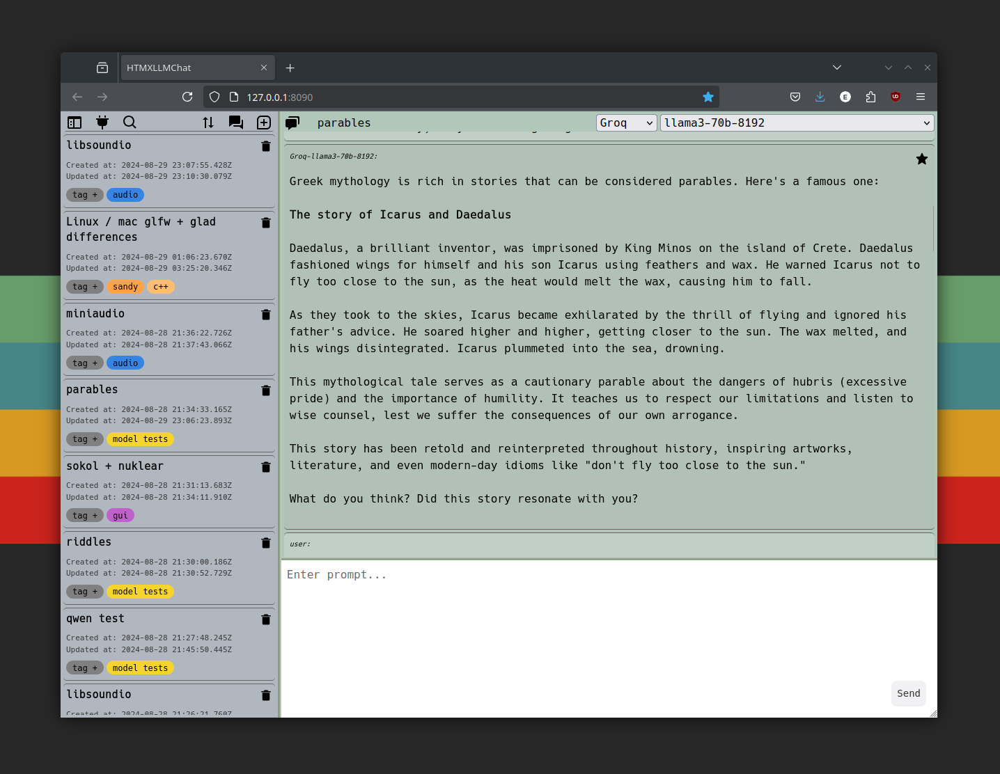

<h1 align="center">
  <br>
  
  <br>
  HTMXLLMChat
  <br>
</h1>

<h4 align="center">A simple frontend for chatting with and organizing conversations with Large Language Models.</h4>

<p align="center">
  <a href="#features">Features</a> •
  <a href="#usage">Usage</a> •
  <a href="#configuration">Configuration</a> •
  <a href="#development">Development</a> •
  <a href="#credits">Credits</a> •
  <a href="#license">License</a>
</p>



## Features

* Connect to any OpenAI compatible API, local or external.
* Switch between APIs and models within conversations.
* Search thread history based on content, tags, models, and usefulness.
* Tag threads to keep common topics readily accessible.
* Mark messages as useful to easily find and for a basic model ranking system.
* Customize colors to your preference.

## Usage

### Run from binaries
- Download from releases
- Open command prompt in htmx-llmchat directory
```shell
./htmx-llmchat serve
```
> **Note**
> Unsigned and mostly untested, you may encounter security warnings before being able to run on macOS and Windows.

### Run from source
- Install <a href="https://go.dev/learn/">Go</a>
- Install <a href="https://templ.guide/quick-start/installation">Templ</a>
```shell
git clone https://github.com/erikmillergalow/htmx-llmchat.git
cd htmx-llmchat
templ generate
go run main.go serve
```
- Connect to 127.0.01:8090 in web browser

To clone and run this application, you'll need [Git](https://git-scm.com) and [Node.js](https://nodejs.org/en/download/) (which comes with [npm](http://npmjs.com)) installed on your computer. From your command line:

## Configuration

- Open the API editor and add an API:<br>

- Enter a display name, the OpenAI compatible API /v1 endpoint, and an API key (not always necessary)
- Press update for changes to take effect

### API Suggestions

#### Ollama (local)
- Easy setup, easy to download and manage models.
- [Download](https://ollama.com/download)
- Run Ollama, download models listed [here](https://ollama.com/library)
- **HTMXLLMChat Config**:
	- URL: http://localhost:11434/v1
	- API Key: ollama

#### Local AI (local)
- [Quickstart](https://localai.io/basics/getting_started/)
- **HTMXLLMChat Config**:
	- URL: http://0.0.0.0:8080/v1
	- No API key needed

#### llama-cpp-python (local)
- Option to run in [OpenAI compatible server mode](https://llama-cpp-python.readthedocs.io/en/latest/#openai-compatible-web-server)
- Create config file to [enable multi-model support](https://llama-cpp-python.readthedocs.io/en/latest/server/#configuration-and-multi-model-support)
- `python3 -m llama_cpp.server --config_file <config_file>`
- **HTMXLLMChat Config**:
	- URL: http://0.0.0.0:8080/v1
	- No API key needed

#### Groq (external, free tier available)
- Offers llama, gemma, and mistral on free tier, fast responses.
- [Create account](https://console.groq.com/login)
- [Generate API key](https://console.groq.com/keys)
- **HTMXLLMChat Config**:
	- URL: https://api.groq.com/openai/v1
	- Paste API key generated in web console

#### OpenAI (external, paid)
- Pay as you go instead of flat ChatGPT Plus rate, access to wider range of models.
- [Create account](https://platform.openai.com/docs/overview)
- [Generate API key](https://platform.openai.com/api-keys)
- **HTMXLLMChat Config**:
	- URL: https://api.openai.com/v1
	- Paste API key generated in web console

> **Note**
> Many other options available, just make sure that they support `/v1/chat/completions` streaming and `/v1/models` to list model options.

> **Note**
> Total and 'useful' chats tracked over time per model and can be viewed in the config menu: 


## Development
- [air](https://github.com/air-verse/air) can be installed for live reloading
- `.air.toml` included in repo
```shell
// run for development

air

// build binaries

make all
```

- [Tauri](https://tauri.app/) can be used to package everything as a standalone desktop app (no browser needed)
```shell
// development mode

npm run tauri dev

// create release bundle
// src-tauri/tauri.conf.json beforeBuildCommand is configured for Github Actions, 
// needs to be modified for local builds

npm run tauri build
```
- Runs on macOS successfully but ran into [this issue](https://github.com/tauri-apps/tauri/issues/5672) while creating release bundle for Linux/Windows. Need to determine if the paths API or BaseDirectory can be used to provide the Pocketbase sidecar access to a non read-only filesystem.

## Credits

This software uses the following open source packages:
- [sashabaranov/go-openai](https://github.com/sashabaranov/go-openai)
- [Pocketbase](https://pocketbase.io/)
- [Templ](https://templ.guide/)
- [HTMX](https://htmx.org/)
- [Air](https://github.com/air-verse/air)
- [Tauri](https://tauri.app/) - (attempted to package as all-in-one program, incomplete)


## License

MIT
